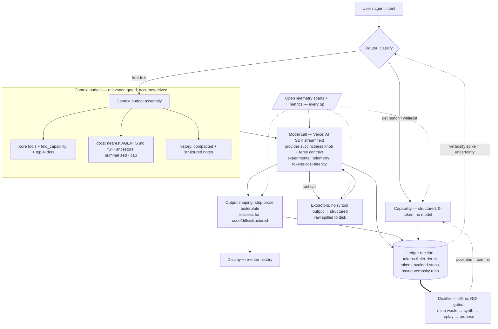

# coder — context · charter · features · journeys · requirements

## Context

LLM tokens are the scarce resource. With model capability stabilizing (Yegge, "the
flat curve"), the craft is spending tokens *wisely* — yet today's agents infer where
they could compute, and let context bloat with tool schemas, docs, and history. The
biggest waste isn't a user asking "what time is it"; it's the **agent** spending a
tool-and-reason chain to derive something deterministic (PR status, test results, a
definition) and dragging raw output into context to do it.

coder's thesis: **prefer computation over inference, and treat context as a managed
budget.** Any fact the agent can compute, it computes — one deterministic call
returning structured data. Everything that competes for the context window (tools,
dets, docs, history) is loaded by *relevance*, not by default. The model is reserved
for genuine reasoning. coder pairs an agent-chat with a real terminal, both pinned to
one git worktree, execution sandboxed per-worktree in a container — and **gets cheaper
the more you use it**.

**Self-contained.** Own repo + binary (`coder`), multi-provider via the Vercel AI SDK.
glrs is prior art only — small patterns reimplemented clean, never imported (see the
**glrs prior-art map**). (Deleting `packages/cmprss` from glrs is a separate cleanup.)

## Evidence base

The principles below are not preferences — recent research backs each one, and several
reframe it more powerfully. Citations are keyed to the **References** at the end.

- **Context is a finite budget — for accuracy, not just cost.** Chroma's *Context Rot*
  study tested 18 frontier models (incl. Claude Opus 4, GPT-4.1, Gemini 2.5) and found
  *every one* degrades as input length grows — even on simple tasks, even controlling for
  difficulty; distractors make it worse [chroma]. The classic *lost-in-the-middle* result
  shows a U-shaped curve: accuracy is highest at the start/end of context and drops >30%
  for information in the middle (RoPE long-term decay + softmax concentration) [lim].
  Anthropic frames context rot as architectural (n² token interactions) and prescribes
  "the smallest possible set of high-signal tokens" [ctx-eng]. → Relevance-gating, doc
  budgeting and compaction here are **accuracy** features, not just cost features.
- **Agents are non-deterministic users of deterministic tools** [tools]. High-signal
  *structured* tool results beat raw output: "a carefully chosen set of 2,000 relevant
  tokens can produce a better result than 20,000 tokens of loosely related code, logs, and
  prior discussion" [tools]. Tools should paginate/filter/truncate with sensible defaults
  and return meaningful structured signal, not opaque IDs. Bloated tool sets are a top
  failure mode: "if a human engineer can't say which tool to use, an agent can't either"
  [ctx-eng]. → Validates Capabilities (structured), Extractors (filter before context), and
  a small core tool set.
- **Loading every tool schema bloats context; retrieve tools on demand.** A meta-tool /
  tool-retrieval layer cuts the token cost of large tool corpora [meta]. → Validates
  `find_capability` + relevance-gated tools; a 500-det corpus costs ~one meta-tool.
- **Long-horizon context has three named techniques** [ctx-eng]: **compaction** (summarize
  near the limit, reinitialize), **structured note-taking** (persist to external store,
  retrieve on demand), **sub-agent architectures** (isolated clean context windows). →
  Validates history compaction, the Ledger-as-external-memory, and sub-agent isolation for
  background jobs.
- **Models are trained to be verbose.** "Verbosity compensation" is pervasive across all
  tested models and datasets: models emit longer, redundant responses under uncertainty,
  with a measurable performance gap between verbose and concise answers; a cascade that
  swaps verbose answers cut compensation 63.81%→16.16% [verb]. API-level controls are more
  reliable than prompt instructions: GPT-5's `verbosity` knob turns the *same prompt* from
  ~260 tokens (low) to ~3000 (high) [gpt5]; Claude's terse list style ≈ verbosity-low.
  Chain-of-Draft (≤5 words/reasoning step) cuts reasoning tokens while preserving accuracy
  [cod]. → Motivates the **Succinctness controller**, and the insight that **a verbosity
  spike is an uncertainty signal** the Router can act on.

## Charter

**Mission:** a coding agent that prefers computation to inference and actively manages
its context budget — minimizing tokens while doing real work, and measurably improving
its own efficiency over time.

**Principles**
1. **Compute, don't infer.** Any fact derivable deterministically becomes one
   structured call — not a tool-and-reason chain, not raw output in context.
2. **Determinism is agent-first and dual-surface** — a tool the agent prefers and the
   same thing the user runs from one `/` palette.
3. **Context is a budget — managed for accuracy *and* cost.** Long context measurably
   degrades model accuracy (context rot; lost-in-the-middle [chroma][lim]), so tools, dets,
   MCP, docs, and history are loaded by relevance and trimmed to a target; nothing is in
   context "just in case."
4. **Compounds, ROI-gated.** Inference waste is distilled into new dets — only when the
   projected savings beat the synthesis cost — replay-validated and human-approved.
5. **Measured by default, OTel-native.** Every operation emits OpenTelemetry spans +
   metrics from day one (speed, tokens, cost, det-hits, context composition, verbosity); for
   every *supported* provider, full usage/cost is extracted. Product analytics via Counted
   (privacy-first). Accuracy = the verify gate, not self-report.
6. **Sandboxed, worktree-pinned, multi-provider, self-contained.**
7. **Succinctness is engineered, not requested.** Model verbosity is a trained-in behavior
   [verb]; we enforce brevity *structurally* — provider output controls + output shaping +
   measurement — and treat verbosity as an uncertainty signal, never as a prompt afterthought.

**Non-goals (v1):** hosted/multi-user service; web UI; non-coding chat; importing glrs
internals; registering any machine-written det without replay + human approval; relying on
"be brief" prompting as the sole brevity lever; shortening code, diffs, or structured
payloads in the name of succinctness.

## The efficiency engine

**Runtime (saves now):**
- **Capabilities** — deterministic, *structured* ops callable by the **agent (as
  tools)** and the user (`/`): `pr_status`, `test_results`, `find_def`, `git_state`, …
  One typed answer, no reasoning chain. Designed per the deterministic-tool principles
  [tools]: structured high-signal results, sensible default limits, no opaque-ID returns.
- **Extractors** — deterministic parsers that reduce noisy tool output (test/lint/
  build/git) to structured signal *before* it hits context; raw spilled to disk.
- **Router** — intake gate: det match → **0 tokens**; free-text → cheapest capable
  tier (escalate on verify-fail *or verbosity spike*); steers the agent's tool calls to
  Capabilities/Extractors.
- **Succinctness controller** — manages the model's *own* output (half the token bill, and
  trained to inflate [verb]) in four defense-in-depth layers, because no single lever is
  reliable:

  | Layer | What | Why (evidence) |
  |---|---|---|
  | **Provider knob** | Normalized `succinctness` setting → per-provider output control in the provider adapter: GPT-5 `verbosity:low` (+ tuned `reasoning_effort`), Claude terse-style system contract, etc. | API params control length far more reliably than prompt text; same prompt 260 vs 3000 tok [gpt5]. |
  | **Output contract** | Terse system charter ("fewest tokens that fully resolve the task; no preamble/postamble; structured where possible") + Chain-of-Draft scratchpad cap for reasoning. Calibrated, not naive "be brief." | CoD cuts reasoning tokens at equal accuracy [cod]; bare "be concise" is weak alone. |
  | **Response shaping** | Output-side extractor strips boilerplate/hedging before display **and before the turn re-enters history** (verbosity compounds across turns). Capabilities return typed structured results — zero prose. | Verbosity accumulates through history; structured > prose (2k>20k finding [tools]). |
  | **Measure & gate** | Ledger records output tokens vs. a per-task-class budget and a **verbosity ratio** (output ÷ minimal-answer estimate); OTel metric `gen.output.verbosity`. A spike flags a low-confidence turn to the **Router** (verify/escalate) instead of trusting a padded answer. | Verbosity compensation correlates with uncertainty — the spike is signal [verb]. |

  Response shaping is **lossless for code, diffs, and structured payloads** — only prose
  boilerplate is removed. The Distiller closes the loop: a repeatedly verbose derivation is a
  prime det candidate — a structured Capability is the ultimate succinctness win (0 prose, 0
  reasoning).

**Offline (compounds over time):**
- **Distiller** — background agent mining the Ledger for **inference waste**. Detection
  is free (heuristics: same intent → same deterministic sequence; high freq × cost;
  outcome independent of reasoning; repeated verbose derivations). Only **ROI-positive**
  candidates (`freq × tokens_saved ≥ payback × synth_cost`) are synthesized, on the **cheap
  tier**, under a **token budget**. Each candidate is **replay-validated** against real
  history, then **proposed** (never auto-registered). Dets track amortized net savings; those
  that don't pay back — or fail replay on drift — are retired. Runs on idle/schedule/`/distill`.

**Registry & approval:**
- Dets stored as files: project `.coder/{capabilities,extractors}/<name>` (committed,
  team-shared, code-reviewable) + global `~/.coder/` (personal; project wins). Each
  carries replay **fixtures** + **provenance** (source receipts).
- `.coder/registry.json` aggregates metadata + live stats (hits, tokens-avoided,
  last-used) updated from the Ledger.
- Proposals land in `.coder/proposals/`; you review **spec + replay result + projected
  ROI** in the TUI (or as a git diff) → accept/edit/reject. Accept = a commit.

**Ledger** — one receipt per task feeds the status bar *and* the Distiller; tracks
tokens/$, tier, det-hit, **tokens-avoided**, **inference-steps-saved**, **verbosity ratio**,
verifyPassed.

## Context management (core)

Context is a priority-ordered budget; coder assembles and trims it every turn — to hold
**accuracy** (context rot degrades every frontier model as length grows [chroma]) as much as
to save cost.
- **Relevance-gated tools.** Capabilities + MCP tools are **lazy**: a small core set is
  always present; the rest are discovered via a `find_capability` meta-tool or injected
  top-N by relevance per task [meta]. A 500-det corpus costs ~one meta-tool at baseline — the
  corpus never bloats context.
- **MCP bloat control.** MCP tool schemas are not dumped wholesale; they're lazy-loaded
  under the same relevance gate (and compacted), enabled per-project.
- **Doc / AGENTS.md budgeting.** Nearest AGENTS.md/CLAUDE.md injected in full; ancestors
  summarized; a subtree's file injected only when the agent touches it; large docs
  chunked + retrieved by relevance — under a doc-context cap.
- **Long-horizon techniques** [ctx-eng]: **compaction** (old turns summarized when the window
  fills, reinitialized high-fidelity); **structured note-taking** (an agent-writable
  scratchpad persisted via the Ledger/event-log and retrieved on demand — keeps progress out
  of active context); **sub-agent isolation** (background jobs run with their own clean
  context window; only their structured result returns).
- **Output & history.** Extractors + read-dedup + spill-to-disk cut tool output; output
  shaping cuts the model's own output; old turns compacted when the window fills.
- **Context meter.** Track and surface the token composition of context (system · tools
  · docs · history · files · verbosity ratio); trim by priority to hold a target.

## Measurement & telemetry (day one)

Three faces of one principle — measure everything:
- **Ledger** — local, file-based per-task receipts (crash-safe; source of truth for the
  Distiller and the status bar). Records output tokens + **verbosity ratio per task class**
  alongside the cost/token trio.
- **OpenTelemetry** — spans + metrics for every operation: each turn, model call,
  tool/Capability call, Extractor, context assembly, Distiller run. Model spans use the
  AI SDK's `experimental_telemetry`, so token usage, model id, latency, and **cost** are
  captured per call; the metric `gen.output.verbosity` tracks succinctness. OTLP export to any
  backend; no-op when unconfigured. Scope: we won't support every AI-SDK provider at once, but
  for **every provider we do support we collect it all** (input/output/cache tokens, cost,
  latency) and normalize it.
- **Counted (counted.dev)** — privacy-first product analytics for feature-level events
  (commands run, det proposals accepted/rejected, jobs, provider mix, `succinctness_setting`
  enum). Opt-out; never code or prompt contents. (glrs already ships `@counted/sdk`.)

## Features

| Feature | Behavior | Cost |
|---|---|---|
| **Agent loop** | model → tool calls → execute → loop; streaming; interrupt | ¢/$ |
| **Capabilities** | deterministic structured ops the agent prefers + user `/`-runs | ⚡ |
| **Extractors** | auto-reduce noisy tool output → structured before context | ⚡ |
| **Router** | det → 0-token; free-text → cheapest tier; steers tool calls | — |
| **Succinctness** | provider verbosity knob + terse output contract + output-shaping + measured verbosity ratio; spike → Router verify | ⚡ |
| **Distiller** | ROI-gated, budgeted, replay-validated proposals from inference waste | ⚡ output |
| **Registry & approval** | `.coder/` files + `registry.json` stats; `/proposals` review (accept/edit/reject) | — |
| **Context budget** | relevance-gated tools/dets/MCP; doc/AGENTS.md budgeting; compaction; notes; meter | — |
| **Command bar** | one `/` palette; `det`/`prompt`/`skill`/`mcp`; cost badge; `$ARGUMENTS` | mixed |
| **Ledger** | per-task receipt; trio + tokens-avoided / steps-saved / verbosity / context composition | — |
| **Telemetry (OTel)** | spans + metrics for every op; per-provider usage/cost via AI SDK; OTLP export | — |
| **Analytics (Counted)** | privacy-first product events (counted.dev); opt-out | — |
| **Tools / Sandbox** | read/write/edit (path-guarded), grep/ls; `bash` in container; 1 container/worktree | — |
| **Terminal + sync** | real shell pane; worktree=unit (1:1 branch); switch re-roots both; drift watcher | ⚡ |
| **Background jobs** | `/bg` detached; `/jobs` list/tail/stop/resume; notify; parallel via worktrees | ¢/$ |
| **Skills / MCP** | `SKILL.md` dirs (agent+`/`); MCP via AI SDK client, lazy + gated | ¢/$ |
| **Multi-provider** | Bedrock/Vertex/Anthropic/Azure; tiers deep/mid/fast/cheap | — |

## User journeys

1. **Agent computes, not infers.** Needs PR CI/review state → calls `pr_status` →
   `{state, checks, reviews}` in one near-zero-token call, instead of `gh pr view` →
   JSON-in-context → reason.
2. **Noisy output, distilled.** Runs the suite → an Extractor yields `{passed:142,
   failed:[…]}`; the agent fixes the failures, never ingesting the raw log.
3. **Big corpus, small context.** A repo with 400 dets + 5 MCP servers: baseline
   context stays lean because tools are relevance-loaded; the agent calls
   `find_capability("coverage")` to pull in just what it needs.
4. **Compounding, ROI-gated.** The Distiller spots the agent repeatedly deriving PR
   state, checks the math (worth it), synthesizes + replays `pr_status`, and proposes
   it; you accept (a commit). That chain never runs again.
5. **Start & task.** `coder` → pick/create worktree → container + tmux (chat left, real
   shell right). Task → edit → approve `[y]` → tests in-container → verify green →
   `git diff` in the shell pane.
6. **Background job.** `/bg refactor the auth module` → keep working → notified on done
   → review diff + verify result.
7. **Terse by construction.** The same "is the build green?" question returns a one-line
   structured verdict, not three paragraphs — the provider knob is at `verbosity:low`, the
   answer is a Capability result, and a verbosity-ratio spike on a free-text turn would have
   flagged the Router to verify rather than trust a padded reply.

## Requirements

**Functional**
- R1 **Capabilities** dual-surface (agent tools + `/` commands), return structured
  minimal results, no model call.
- R2 **Extractors** auto-reduce registered noisy tools' output before context; raw to disk.
- R3 Agent biased (prompt + tool design) to prefer Capabilities; Router steers tool calls.
  Capability/tool design follows the deterministic-tool principles [tools] — structured
  high-signal results, sensible default limits, small core set, no opaque-ID returns.
- R4 **Router** classifies input (det | `/` | free-text); det/whitelist → 0 tokens;
  ambiguous → model; free-text → cheapest tier, escalate on verify-fail or verbosity spike.
- R5 **Distiller**: free heuristic detection → ROI gate (`freq×saved ≥ payback×cost`) →
  cheap-tier synthesis under a token budget → **replay-validate** → propose → approve →
  register → amortize → repair/retire. Nothing registers without replay **and** approval.
- R6 **Registry**: dets are files in `.coder/` (project, committed) + `~/.coder/`
  (global), with fixtures + provenance; `registry.json` aggregates live stats from the
  Ledger; documented project>global precedence.
- R7 **Context budget**: tools/Capabilities/MCP loaded by relevance (lazy +
  `find_capability`), not all-in-context; AGENTS.md/docs assembled under a cap (nearest
  full, ancestors summarized, subtree-on-touch, big docs chunked); history compaction +
  structured note-taking + sub-agent isolation; expose context composition. Context is
  trimmed to hold **accuracy and cost** targets (context rot [chroma]).
- R8 Agent loop streams text + tool calls; write/bash gated by inline approval;
  interruptible; resumable.
- R9 Tools confined to the worktree (reject `..`/symlink); `bash` runs in the container.
- R10 **Ledger** receipt per task; exposes det-hit-rate, $/task, first-try-success,
  tokens-avoided, inference-steps-saved, verbosity ratio, context composition.
- R11 Command bar (`det`/`prompt`/`skill`/`mcp`, badges, `$ARGUMENTS`, extensions);
  background jobs (detached, list/tail/stop/resume/notify, parallel by worktree);
  providers Bedrock/Vertex/Anthropic/Azure, tiered, cheap default.
- R12 **Telemetry from day one**: OpenTelemetry spans + metrics for every operation
  (turn, model call, tool/Capability, Extractor, context assembly, Distiller); model
  spans capture per-provider usage + **cost** via the AI SDK; OTLP export, no-op when
  unconfigured. For every supported provider, capture full usage/cost/latency. Product
  events to Counted (counted.dev).
- R13 **Succinctness**: a normalized `succinctness` setting maps to per-provider output
  controls (verbosity params where available; terse system contract otherwise). Output-side
  response shaping strips prose boilerplate before display and before re-entering history.
  Capabilities return structured/no-prose results. Ledger + OTel record output tokens and a
  verbosity ratio per task class; verbosity spikes feed the Router as an uncertainty signal
  (verify/escalate).

**Non-functional**
- N1 Self-contained repo + `coder` binary; zero runtime glrs dependency.
- N2 A Capability/det answers <100 ms, no network/model.
- N3 Creds never enter the sandbox; only the host loop holds them.
- N4 Crash-safe receipts/jobs/registry (append-only logs; state derivable by replay).
- N5 Loop + Router + Extractors + context-assembly unit-testable against a mock model.
- N6 Distiller is net-token-positive in aggregate (amortization tracked); bounded per-run budget.
- N7 Preflight + clear errors for missing docker/tmux; refuse nested tmux.
- N8 Telemetry/analytics are privacy-first and opt-out; never transmit code or prompt
  contents; OTel is a no-op when no exporter is configured.
- N9 **Succinctness is enforced structurally** (provider params + shaping + measurement),
  never by prompt alone. The verbosity metric is computed with no model call. Response shaping
  is **lossless for code, diffs, and structured payloads** — only prose boilerplate is
  removed; code/structured output is never truncated for brevity.

## glrs prior-art map

Each `coder` component names the glrs file it reimplements clean. **Reference only — never
import** (R/N1). The one large delta is the loop runtime: **glrs delegates the agent loop to
the OpenCode SDK; `coder` owns its loop on the Vercel AI SDK.**

| `coder` component | glrs prior art (reference) | Delta to reimplement |
|---|---|---|
| Agent loop | `packages/adapter-opencode/src/opencode-adapter.ts` (SSE event loop, cost/permission/interrupt handling); `packages/autopilot/src/loop.ts` (iteration/stall) | **Own loop on Vercel AI SDK `streamText` + tool-exec cycle** (multi-provider, `experimental_telemetry`). |
| Model tiers | `packages/agent-core/src/index.ts` (deep/mid/fast/cheap + `AGENT_TIERS`); `packages/autopilot/src/model-resolver.ts` (tier→model) | Tier→provider resolution via AI SDK provider objects. |
| Ledger | `packages/harness-opencode/src/plugins/cost-tracker.ts` (append-only `costs.jsonl` + rollup, replay-on-startup) | Extend receipt with tokens-avoided, steps-saved, det-hit, verifyPassed, **verbosity ratio**. |
| Extractors | `packages/harness-opencode/src/plugins/tool-hooks.ts` (backpressure head/tail/grep-count truncation, read-dedup by content hash, post-edit `tsc` verify) | Promote to first-class registered structured parsers; spill raw to disk. |
| Telemetry / analytics | `packages/harness-opencode/src/lib/telemetry-events.ts` + `lib/analytics.ts` (Counted SDK, `DO_NOT_TRACK`/`*_NO_ANALYTICS`, `beforeExit` flush) | **Add OpenTelemetry spans/metrics — glrs has none.** Keep Counted patterns. |
| Worktree + registry | `packages/cli/src/lib/worktree.ts` (`createWorktree`, `assertPrimaryClone` nested-guard) + `registry.ts` (`~/.glrs/worktrees.json`, prune-on-load) | Add per-worktree container + tmux pinning. |
| Background jobs | `packages/harness-opencode/src/tools/background.ts` (`background_run`/`check`, `meta.json`+stdout+exit, session isolation, timer-poll rejection, `until`-watcher) | Surface as `/bg` + `/jobs`; parallel via worktrees. |
| Skills / MCP | `packages/harness-opencode/src/skills/paths.ts` + `mcp/index.ts` (bundled skills, MCP config) | **Lazy + relevance-gated** — glrs loads all upfront. |
| TUI | `packages/cli/src/tui/components/Dashboard.tsx`, `AutopilotExecution.tsx` (Ink→stderr, status bar cost/tokens, inline progress) | Add `/` palette + proposals review + shell pane beside (tmux). |
| Command bar | `packages/harness-opencode/src/commands/index.ts` (`/fresh` `/ship` …, prompt templates, `$ARGUMENTS`, extension hooks) | One `/` palette over det/prompt/skill/mcp. |
| Router escalation | `packages/harness-opencode/src/plugins/stall-detector.ts` (exploration/repeat loop detection) | Feed verify-fail + verbosity-spike escalation. |

**Net-new (no glrs prior art):** Docker container sandbox per-worktree; tmux split panes;
OpenTelemetry; Capabilities; Router (0-token det match); Distiller; capability/extractor
Registry with fixtures+provenance; `find_capability`/relevance-gated tools; context meter; doc/
AGENTS.md budgeting; **Succinctness controller**. (glrs's only production sandbox is eval-local
git clones; no Docker, no tmux, no OTel.)

## Single-turn flow



Load-bearing claims: the Router can answer det-matches with **zero model tokens**; context is
assembled by relevance *before* the model sees it (accuracy lever); the model call carries
succinctness controls + telemetry; Extractors compress tool output and output-shaping
compresses model output, both feeding a Ledger that closes two loops — the **Router**
(verbosity spike → verify) in real time and the **Distiller** (waste → new Capability) offline.
OTel observes every node.

## Repo & layout (decided)

New standalone repo, own `coder` binary, zero glrs dependency. Bun workspace:

```
coder/
  bin/coder
  packages/coder-server/   # Router, AI SDK loop, tools, Capabilities, Extractors,
                           #   Succinctness controller, context-manager, Ledger,
                           #   telemetry (OTel+Counted), Distiller, registry, SSE
  packages/coder-tui/      # Ink client: chat pane + / palette + proposals review
  packages/coder-core/     # protocol/types, worktree+git glue, event-log, loaders
  .coder/                  # (in target repos) capabilities/ extractors/ proposals/
                           #   fixtures/ registry.json
```

## Shape & phases (each independently runnable)

- **P0** repo scaffold + worktree/container/tmux substrate (sandboxed shell, no agent).
- **P1** agent loop + tools + first Capabilities/Extractors + Router + **context
  manager (relevance-gated tools, doc budget)** + Ledger + **OTel spans/cost from the
  first loop** + **Succinctness layers 1–2 (provider knob + output contract) and the
  verbosity metric in the Ledger from the first receipt**, headless (`coder --once`); loop
  tested against a mock model.
- **P2** TUI: chat + `/` palette (cost badges) + inline approvals + interrupt +
  status-bar (trio + tokens-avoided + context meter + **verbosity ratio**), beside the shell
  pane; **Succinctness layers 3–4 (response shaping + Router verify-on-spike)**. **← MVP**
- **P3** Distiller (ROI-gated, treats verbose derivations as det candidates) + registry/
  proposals review; background jobs (**sub-agent isolation**) + **structured note-taking**;
  MCP (lazy); nested AGENTS.md/CLAUDE.md; verify-gate accuracy; `coder stats`.

## References

- [ctx-eng] Anthropic — *Effective context engineering for AI agents*.
  https://www.anthropic.com/engineering/effective-context-engineering-for-ai-agents
- [tools] Anthropic — *Writing effective tools for AI agents*.
  https://www.anthropic.com/engineering/writing-tools-for-agents
- [chroma] Chroma — *Context Rot: How Increasing Input Tokens Impacts LLM Performance*.
  https://www.trychroma.com/research/context-rot
- [lim] Liu et al. — *Lost in the Middle: How Language Models Use Long Contexts*. arXiv:2307.03172.
- [verb] *Demystify Verbosity Compensation Behavior of Large Language Models*. ACL 2025.
  https://aclanthology.org/2025.uncertainlp-main.14/
- [cod] *Chain of Draft: Thinking Faster by Writing Less*. arXiv:2502.18600.
- [meta] *Optimizing Agentic Workflows using Meta-tools*. arXiv:2601.22037.
- [gpt5] OpenAI — GPT-5 `verbosity` parameter (API prompt-guidance docs).
- Anthropic Claude cookbook — *Context engineering: memory, compaction, and tool clearing*.
